# Game Telemetry Data Science Platform

A full Streamlit-based Data Science project designed for a **Data Scientist Project**.

The project uses **synthetic entertainment-device telemetry data** to demonstrate:

- Python-based data analysis
- SQL / SQLite database work
- Machine Learning with scikit-learn
- Forecasting and maintenance-risk prediction
- Anomaly detection for unusual machine/device behavior
- Data quality checks
- Stakeholder-oriented dashboards
- CSV / Excel / PDF report exports
- Login and role-based access
- Azure Data / SAP Datasphere style pipeline simulation
- Model monitoring and run history

No real customer or company data is used.

---

## 1. How to run

### Step 1: Create a virtual environment

```bash
python -m venv .venv
```

### Step 2: Activate it

Windows PowerShell:

```bash
.venv\Scripts\Activate.ps1
```

Windows CMD:

```bash
.venv\Scripts\activate.bat
```

macOS / Linux:

```bash
source .venv/bin/activate
```

### Step 3: Install requirements

```bash
pip install -r requirements.txt
```

### Step 4: Start the Streamlit app

```bash
streamlit run app.py
```

The app will create a local SQLite database automatically.

---

## 2. Default login

The app creates a default admin account on first run:

```text
Username: admin
Password: admin123
```

You can also register new users from the login screen.

Roles:

- `admin` – full access
- `analyst` – dashboards, ML, reports
- `manager` – stakeholder dashboard and reports

---

## 3. Project pages

### Executive Dashboard
Business KPIs for decision makers:

- Total revenue
- Average daily revenue
- Total sessions
- Active devices
- Error rate
- Maintenance events

### Data Explorer
Filter and inspect raw/aggregated telemetry data:

- Date range
- Location
- Game title
- Device type
- Software version

### R&D and Game Performance
Analyze how games, devices, locations, and software versions perform.

### Machine Learning Lab
Train and evaluate:

1. Revenue forecasting model
2. Maintenance-risk classification model
3. Anomaly detection model

### Device Health
Understand device error patterns, usage intensity, maintenance status, and predicted risk.

### Anomaly Detection
Detect abnormal revenue drops, error spikes, and unusual device behavior.

### Data Quality Center
Check missing values, duplicates, impossible values, outliers, and schema quality.

### Reports
Generate:

- CSV exports
- Excel workbook
- PDF stakeholder summary

### Admin
Admin user management and project settings.

---

## 4. Why this project?


| Requirement | Covered by this project |
|---|---|
| Python or R | Python, Pandas, scikit-learn |
| SQL and databases | SQLite database, SQL queries |
| ML frameworks | scikit-learn models |
| Statistics and data analysis | EDA, KPI analysis, model metrics |
| Structured and unstructured data | Tabular telemetry + synthetic text/event logs |
| Visualization | Streamlit charts |
| Stakeholder communication | Executive dashboard and reports |
| R&D support | Game, device, and software-version analytics |

---

## 5. Suggested GitHub description

**Game Telemetry Data Science Platform**  
End-to-end Streamlit and Python project for analyzing synthetic entertainment-device telemetry data. Includes SQL-based data storage, data quality checks, revenue forecasting, maintenance-risk prediction, anomaly detection, model monitoring, and stakeholder-oriented dashboards/reports.

---

## 6. Screenshots

Outputs

<p align="center">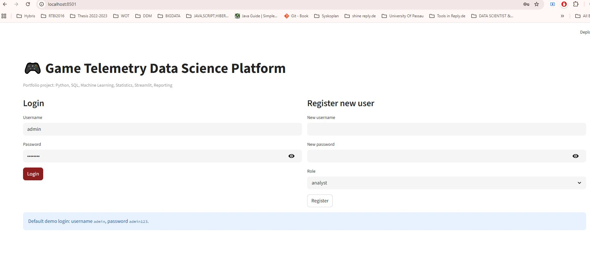</p>
<p align="center">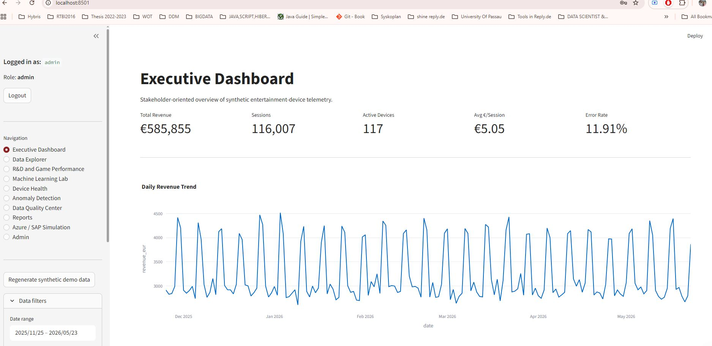</p>
<p align="center">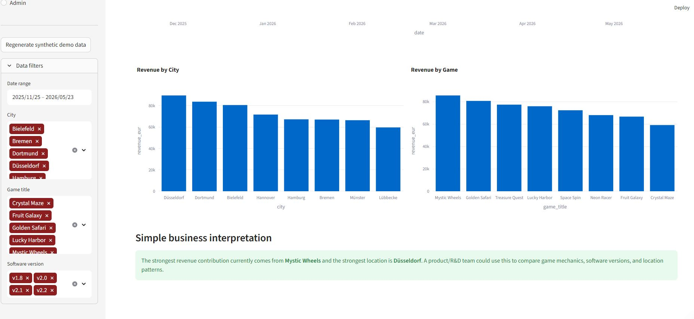</p>
<p align="center">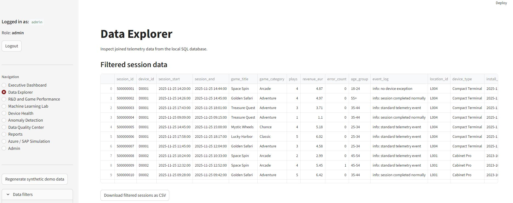</p>
<p align="center">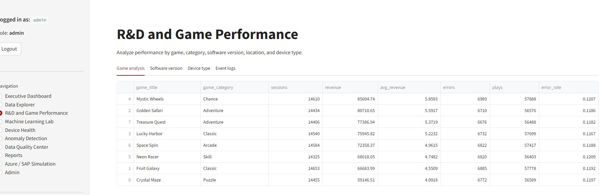</p>
<p align="center">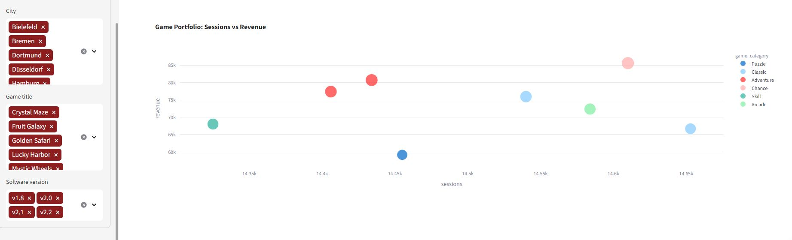</p>
<p align="center">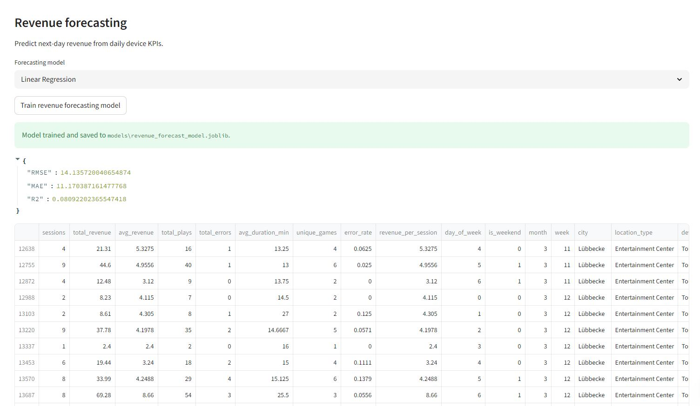</p>
<p align="center">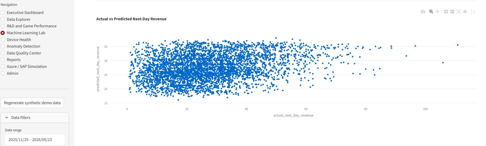</p>
<p align="center">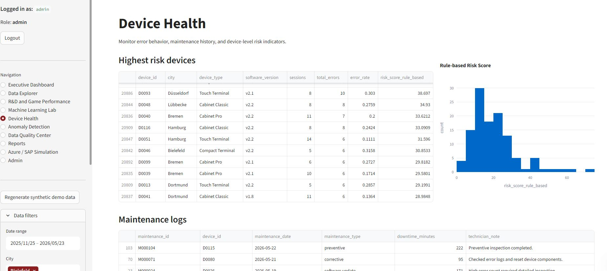</p>
<p align="center">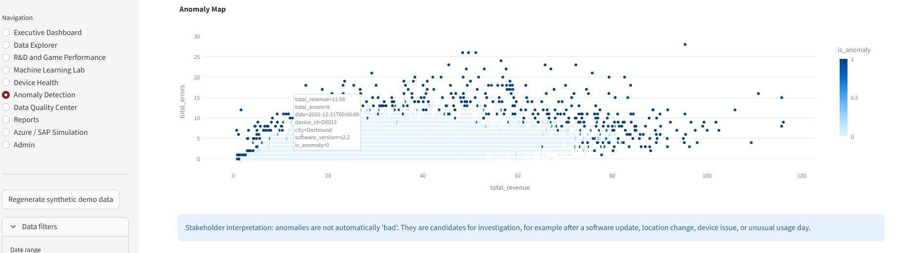</p>
<p align="center">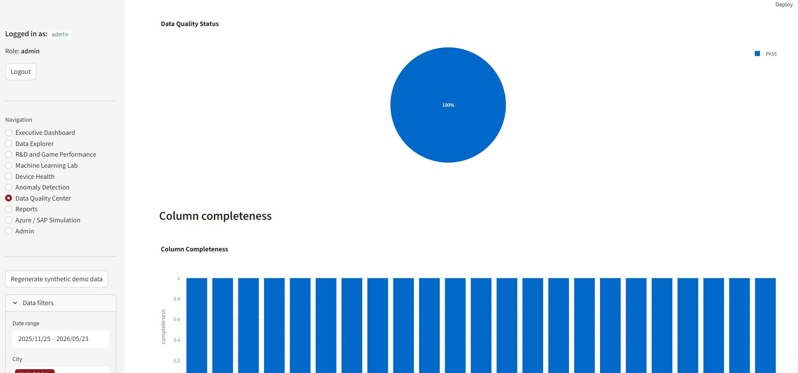</p>
<p align="center">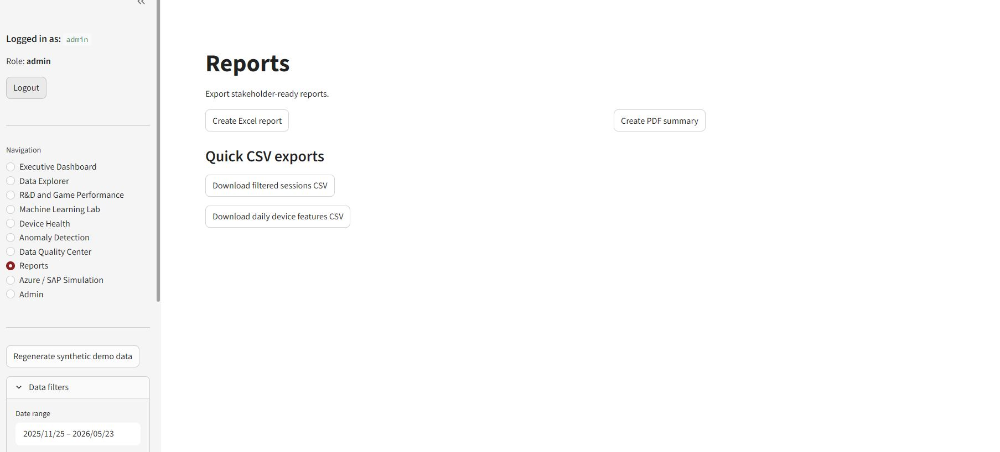</p>
<p align="center">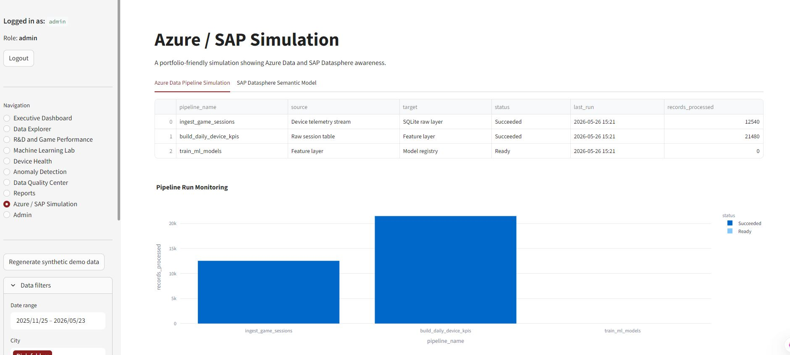</p>
<p align="center">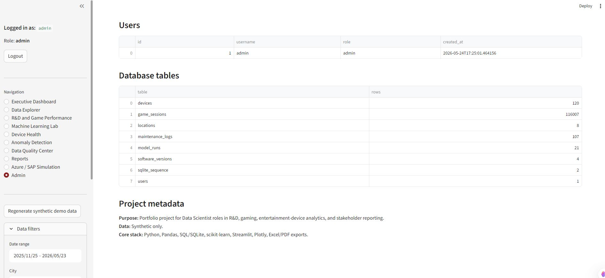</p>


---

## 7. Notes

This project is created for learning, portfolio, and interview demonstration purposes. It does not use real company, gambling, or customer data.
